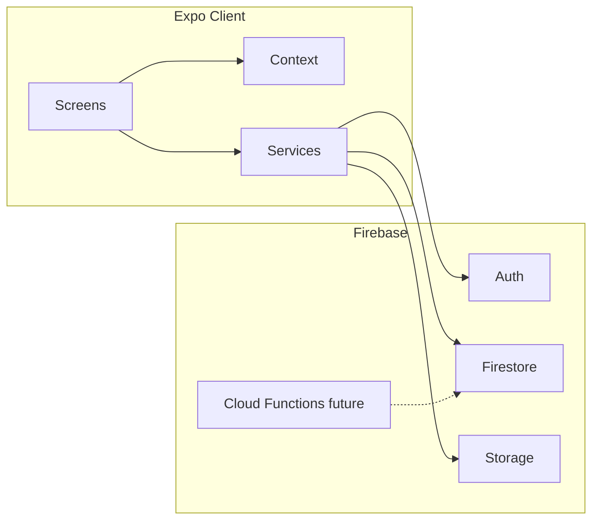

# Branch Product Refinement Guide (Deep Reference)

**Branch reviewed:** `sathvik/IAA-01`  
**Review date:** `2026-04-02`  
**Basis:** Root `PRD.md`, architecture and checklist markdown, `AGENTS.md` / `Agents.md`, `README.md`, implementation under `src/`, Firebase rules, `package.json`, and navigation configuration.

---

## How to use this document

| Section | Use when you need… |
|--------|---------------------|
| [§1 Executive summary](#1-executive-summary) | Direction and sequencing |
| [§2 Branch reality](#2-current-branch-reality-verified) | What exists vs what is claimed |
| [§3 Doc map](#3-documentation-map--source-of-truth) | Which file to trust |
| [§4 PRD ↔ code traceability](#4-prd--implementation-traceability) | Gap analysis by PRD area |
| [§5 Refined requirements](#5-better-refined-requirements) | Spec-quality requirements + acceptance notes |
| [§6 User flows](#6-actionable-user-flows--execution-steps) | Flows and ordered execution |
| [§7 Gaps](#7-gaps-to-fill-prioritized) | What is missing, with priority |
| [§8 Improved PRD](#8-improved-prd-branch-aligned) | Replace/supersede legacy PRD narrative |
| [§9 MVP scope](#9-mvp-vs-out-of-mvp--borderline) | Scope boundaries |
| [§10 Architecture](#10-better-architecture) | Target model and client layout |
| [§11 Good-to-have](#11-good-to-have-features-ranked) | Post-MVP and nice extras |
| [§12 Backlog](#12-recommended-backlog-by-priority) | P0–P2 ordering |
| [§13 Prompt library](#13-extensive-prompt-library-by-section--feature) | Copy-paste agent prompts |

---

## 1. Executive summary

This branch is a **real Expo + Firebase** app: auth, documents, checklist templates/instances, profile and business profile, dashboard, media logs, and security rules. It is **not** an empty scaffold.

The main problem is **drift** between product narrative, legacy PRD, helper docs, and code:

- **`PRD.md`** still describes **Supabase + Vercel**, **offline-first**, and MVP features (incidents, maintenance, role enforcement, public visibility) that are **not** implemented on Firebase.
- **Naming** mixes “internal aggregator,” generic compliance (`ISO_9001`, `HIPAA` in `src/constants/constants.js`), and **food truck** positioning.
- **Roles** exist as constants; **signup defaults to `staff`** (`SignupScreen.js`), which conflicts with an **owner-first** MVP.
- **Checklist** logic is relatively strong (templates, sync, filtering); **compliance score** is intentionally simplistic per `CHECKLIST_DATA_AND_SCORING.md`.
- **Hard issues:** `App.js` uses `<View>` without importing `View` from `react-native`. `src/services/mediaLogs.js` imports `auth` from `./firebase`, but `firebase.js` exports `getFirebaseAuth`, `db`, `storage`—not `auth`.
- **Tooling:** `package.json` has **no** `lint`, `test`, or CI scripts—only Expo start targets.

**Recommended strategy:** stabilize and align docs + blockers, then execute a **strict owner-first MVP** (onboarding → checklists + documents → dashboard/readiness → score v2 → inspection readiness → export). Defer multi-user, incidents, maintenance, and public map until the **business/team** data model exists.

---

## 2. Current branch reality (verified)

### 2.1 Implemented (high confidence)

- Expo app: `App.js`, `src/navigation/*`, tab stack (Dashboard, Documents, Checklist, Profile, Media Logs).
- Firebase JS SDK: `src/services/firebase.js` (Auth with RN persistence, Firestore, Storage; web IndexedDB persistence where applicable).
- Auth screens: login, signup, forgot password; `AuthContext`.
- Firestore/Storage abstractions: `firestore.js`, `storage.js`.
- Checklist: template sync/filtering/instance generation (`checklistTemplateSync.js`, `checklistFiltering.js`, `checklistInstanceSync.js`, scheduling helper).
- Documents: list, detail, upload, edit, delete UI + services.
- Media logs: UI + service layer (service import bug—see below).
- Theming: `ThemeContext`, Paper, glass/blur styling patterns.
- Firebase rules (repo) for users, documents, checklist items, media logs, templates (as documented in Firebase markdown files).

### 2.2 Partially implemented

| Area | Reality |
|------|---------|
| Compliance score | Dashboard formula: checklist completion + document presence bonus—see `CHECKLIST_DATA_AND_SCORING.md`. |
| Roles | `USER_ROLES` in constants; Firestore may store `role`; **no** differentiated UI/permissions. |
| Business profile | Captured in profile modals; **no** mandatory onboarding gate as first-class flow. |
| Deep linking | `navigationConfig.js` defines prefixes and future paths; not fully productized. |
| Offline | Firestore persistence discussed in `firebase.js`; **not** “offline-first” in the PRD sense on RN + JS SDK. |
| Template operations | n8n / global template ingestion described in `CHECKLIST_TEMPLATE_SCHEMA.md`; **not** in-repo automation. |

### 2.3 Missing vs legacy `PRD.md` promises

- Incident logging, maintenance tasks, staff management, inspection mode, PDF/export pipeline, certification module distinct from documents, public visibility, phone auth, Supabase RLS, Vercel admin—**either missing or not applicable to current stack**.

### 2.4 Verified code issues (fix first)

| Issue | Location | Notes |
|-------|-----------|--------|
| Missing `View` import | `App.js` | Uses `<View style={styles.root}>`; imports only `Platform`, `StyleSheet` from `react-native`. **Runtime failure.** |
| Invalid auth import | `src/services/mediaLogs.js` | `import { auth } from './firebase'` — **should** use `getFirebaseAuth()` pattern used elsewhere. |
| Default role | `src/screens/auth/SignupScreen.js` | `role: USER_ROLES.STAFF` — should default to **owner** for first account / owner-first MVP. |
| Legacy package name | `package.json` | `"name": "internal-aggregator-app"` — consider aligning with product name when branding is fixed. |

### 2.5 Documentation that lies or misleads

| File | Problem |
|------|---------|
| `PRD.md` | Supabase/Vercel, offline-first, MVP scope ≠ Firebase implementation. |
| `README.md` | Canonical quick orientation: entrypoint, `src/`, Firebase, npm scripts. |
| `ui.md` | Web/Tailwind/shadcn oriented — not RN execution path. |
| `PHASE2_NAVIGATION_SUMMARY.md` | Likely stale vs current tab + stack structure. |

### 2.6 Documentation still useful

- `CHECKLIST_TEMPLATE_SCHEMA.md`, `CHECKLIST_DATA_AND_SCORING.md`
- `FIREBASE_SETUP.md`, `FIREBASE_QUICK_START.md`, `FIRESTORE_INDEXES.md`, `ERROR_HANDLING_GUIDE.md`, `ACCESSIBILITY_CHECKLIST.md`
- `AGENTS.md` / `Agents.md` (conventions—**but** stack line still mentions Node/Express as generic backend; adjust when you standardize on Firebase-only MVP)

---

## 3. Documentation map & source of truth

**Until `PRD.md` is rewritten for Firebase, treat this guide + `CHECKLIST_*` + Firebase docs as the engineering source of truth for the branch.**

Suggested doc hygiene (execution, not philosophy):

1. Add a short **`ARCHITECTURE.md`** at repo root: Expo, Firebase Auth/Firestore/Storage, no Supabase—single page.
2. Update **`PRD.md`** with a top banner: “Superseded sections: see `BRANCH_PRODUCT_REFINEMENT_GUIDE.md` §8” OR fork into `PRD_FIREBASE_MVP.md` (only if team agrees).
3. Keep **`README.md`** project overview and scripts aligned with `package.json` and `src/`.
4. Update **`AGENTS.md`**: reflect actual priorities (onboarding, readiness, score v2) and “Firebase-first MVP; Express optional later.”

---

## 4. PRD → implementation traceability

| PRD area (`PRD.md` §6) | Branch status | Notes |
|------------------------|---------------|--------|
| 6.1 Auth & roles | Auth **yes**; roles **weak** | Email/password; default `staff` bug. |
| 6.2 Truck / business setup | **Partial** | Business profile exists; not gated onboarding. |
| 6.3 Digital checklists | **Strong** | Templates + instances + UI. |
| 6.4 Incidents & maintenance | **Missing** | Constants exist; no screens/services. |
| 6.5 Compliance scoring | **Partial** | Simple formula; no incidents/maintenance inputs. |
| 6.6 Inspection readiness | **Missing** | Placeholder routes in config only. |
| 6.7 Certification tracking | **Partial** | Documents + expiry possible; not “certification-first” UX. |
| 6.8 Public visibility | **Missing** | — |
| 7 NFR offline / sync | **Misaligned** | PRD promises; architecture is online-first JS SDK. |
| 8 Technical Supabase | **Wrong** | Firebase in code. |

---

## 5. Better refined requirements

### 5.1 Product positioning (single sentence)

**Mobile-first food truck compliance operations app** that keeps operators inspection-ready via **profile-personalized checklists**, **compliance documents**, **evidence (media logs)**, and a **readiness view**—not a generic enterprise aggregator.

### 5.2 Personas (MVP focus)

1. **Owner/operator** — primary; configures business, owns documents, sees readiness.  
2. **Staff** — secondary; complete checklists and attach evidence (post–business model).  
3. **Template admin** — out-of-app; maintains `checklistTemplates` (n8n/console).

### 5.3 Refined functional requirements (with acceptance focus)

#### FR-AUTH: Authentication

- Email/password sign up, sign in, sign out, password reset.
- Session survives restart (Firebase + persistence already intended).
- **Default role for self-serve signup:** `owner` (until invite flow exists).
- **Acceptance:** Cold start returns to correct stack; unauthenticated users cannot reach main tabs.

#### FR-ONBOARD: Owner onboarding

- If business profile incomplete → **blocking onboarding** (not only optional modal).
- Required MVP fields: **state**, ≥1 **food type**, ≥1 **compliance area**; strongly recommended: truck type, business type.
- On completion: **template sync + instance generation** run reliably.
- **Acceptance:** New user never lands on a “full” dashboard without minimum profile; retry on failure is clear.

#### FR-CHECKLIST: Checklists

- Today / upcoming / completed; completion timestamps; notes; optional photos.
- Single source of truth: align **`completed` boolean** and **`status`** string (no contradictory states).
- Manual one-off items remain supported if already in product.
- **Acceptance:** Profile change refreshes applicable instances without duplicates; completing an item updates dashboard in realtime.

#### FR-DOCS: Documents as compliance artifacts

- Categories aligned to **food truck** context (permits, licenses, food safety, fire, insurance, inspection reports—not only generic ISO/HIPAA labels unless you keep them as internal codes).
- Expiration optional but **surfaced** when set; expiring soon / expired visible in list and dashboard.
- **Acceptance:** User can renew workflow: see warning → replace file / edit metadata → score/readiness update.

#### FR-DASH: Dashboard as control center

- Surfaces: due today, overdue, expiring documents, recent evidence, readiness summary (not only a number).
- **Acceptance:** Four questions answerable in &lt; 10 seconds: due today, overdue, expiring, “am I ready?”

#### FR-MEDIA: Evidence

- Photo/video + note + date; scoped to user (later `businessId`).
- Service layer must use **`getFirebaseAuth()`** (or equivalent) consistently.
- **Acceptance:** Create, list, delete work end-to-end on device.

#### FR-SCORE: Compliance score

- Framed as **readiness indicator**, not legal compliance.
- v2 factors: completion, overdue penalty, expiring/expired docs, missing **required** doc classes (once defined), optional evidence freshness.
- **Acceptance:** 0–100, breakdown UI, disclaimer copy.

#### FR-READY: Inspection readiness

- **v1:** In-app summary (checklist coverage, doc status, evidence, blockers by severity).  
- **v2:** Export/share (PDF or share sheet)—after v1 is trustworthy.

#### FR-TEAM: Roles (post–data model)

- Owner vs staff behavior enforced in **Firestore rules + UI**, not only constants.
- Requires **`businesses` + `businessMembers`** (or equivalent)—see architecture.

#### FR-NFR: Non-functional

- List performance: `FlatList`, pagination where lists grow.
- Listeners unsubscribed on unmount.
- Upload validation (size/type) and progress/errors.
- `accessibilityLabel` on interactive controls (per `AGENTS.md`).
- No secrets in repo; `.env` for Firebase config.

---

## 6. Actionable user flows & execution steps

### 6.1 Owner first-run (MVP happy path)

1. Sign up → account is **owner**.  
2. Onboarding screen(s) collect business profile (required fields).  
3. Sync templates → generate instances.  
4. Prompt to upload **minimum document set** (soft block with skip only if product allows).  
5. Land on dashboard with due today + baseline score + readiness teaser.  
6. Deep link: optional later.

**Execution checklist (engineering order):**  
Fix `App.js` + `mediaLogs.js` → fix signup role → onboarding gate + navigation → verify template sync hooks → dashboard sections → readiness screen → score v2 → export.

### 6.2 Daily compliance

Open app → dashboard → complete today’s items (notes/photos) → optional media log → dashboard updates live.

### 6.3 Document renewal

Dashboard/documents highlight → detail → upload new file or edit expiry → status clears → score/readiness refresh.

### 6.4 Inspection prep

Readiness screen → review blockers → fix or acknowledge → (later) export PDF / share.

### 6.5 Staff (future)

Invite → accept → assign tasks → staff completes → owner reviews. **Blocked** until shared `businessId` model.

---

## 7. Gaps to fill (prioritized)

### P0 — Ship blockers & trust

- `App.js` missing `View` import.  
- `mediaLogs.js` firebase auth import.  
- Signup default role.  
- Align `README.md` and PRD stack statements with reality.  
- Add minimal **quality gate**: ESLint + Prettier or `expo doctor` in CI (script in `package.json`).

### P1 — MVP completeness

- Owner onboarding gate + flow.  
- Dashboard: due / overdue / expiring / evidence + readiness copy.  
- Document UX: expiring soon filters; category taxonomy vs food truck.  
- Checklist: `completed` / `status` consistency.  
- Inspection readiness screen (in-app).  
- Compliance score v2 + breakdown.

### P2 — Scale & differentiation

- `businessId` + members + rules refactor.  
- Push reminders (Expo notifications + Cloud Functions).  
- Incidents & maintenance modules.  
- Public profile / map.  
- Analytics (Firebase Analytics or equivalent).  
- Template ingestion automation in repo or runbook.

### Product / data model gaps

- **userId-only** collections block real staff collaboration.  
- **Document types** in constants skew enterprise; PRD is food truck—reconcile.  
- No **required document matrix** by state/business type (template for rules).  
- No **incident** or **maintenance** collections wired to UI despite constants.

### Honesty gap (expectations)

- Do not market **offline-first** until RN Firebase native stack or clear queueing exists; say **“works best online; resilient when reconnecting.”**

---

## 8. Improved PRD (branch-aligned)

Use this as the **canonical MVP story** for the Firebase branch (replace or prepend to legacy `PRD.md`).

### 8.1 Product

**Working name:** Food Truck Compliance (mobile).  
**One-liner:** Daily, personalized compliance tasks plus documents and evidence so owners know if they are inspection-ready.

### 8.2 Problem

Operators juggle permits, logs, and checklists on paper or in spreadsheets; they forget renewals and cannot prove readiness under stress.

### 8.3 Solution (MVP)

- Firebase-backed mobile app (Expo).  
- Global **checklist templates** filtered by **business profile**.  
- User-scoped **checklist instances**, **documents**, **media logs**.  
- **Dashboard** + **readiness** view + **readiness score** with explicit breakdown.

### 8.4 Users

- **Primary:** Owner-operator.  
- **Secondary (phase 2):** Staff.  
- **Admin:** Template publishers (out of app).

### 8.5 MVP goals

- Complete onboarding with profile.  
- Complete at least one checklist on day one.  
- Upload critical documents with expiry where relevant.  
- Understand inspection readiness from one screen.

### 8.6 MVP features (in)

- Email/password auth, persistent session.  
- Owner onboarding + business profile.  
- Template sync + checklist instances + daily use UX.  
- Documents CRUD + expiry surfacing.  
- Media logs as evidence.  
- Dashboard (due, overdue, expiring, activity).  
- Readiness screen (in-app).  
- Score v2 with breakdown.  
- Basic export or share (after readiness v1).

### 8.7 Out of MVP

- Public compliance map, regulator portal.  
- Full multi-truck enterprise.  
- AI coaching, complex jurisdictional rule engine.  
- Full maintenance workflow.  
- Phone OTP auth (unless trivial add).

### 8.8 Non-functional (realistic)

- Target: responsive UI on mid-tier phones.  
- Firestore listeners cleaned up; uploads validated.  
- Security rules match paths; no direct SDK calls from UI (services layer).  
- Accessibility labels on interactive elements.

### 8.9 Success metrics

- % users completing profile in session 1.  
- % completing ≥1 checklist day 1.  
- Weekly checklist completion rate.  
- % with required doc classes uploaded (once defined).  
- Count of overdue critical items trending down.  
- Readiness score delta over 30 days.

### 8.10 Risks

- Overstating score → legal/brand risk (mitigate with copy + breakdown).  
- Offline expectations vs stack (mitigate with honest positioning).  
- Delaying `businessId` → staff features blocked (mitigate with phased migration plan).

---

## 9. MVP vs out of MVP & borderline

| In MVP | Out of MVP | Borderline (decide per sprint) |
|--------|------------|---------------------------------|
| Auth, onboarding, profile | Public map | Staff invites (late MVP if model ready) |
| Checklists + evidence | Regulator dashboards | Push notifications (needs Functions) |
| Documents + expiry | AI regulation engine | PDF branding / polish |
| Media logs | Multi-truck accounts | Incident logging (if score v2 needs it) |
| Dashboard + readiness v1 | Enterprise SSO | Maintenance (usually post-MVP) |
| Score v2 + breakdown | Advanced analytics | SMS reminders |

**Recommendation:** Keep **borderline** items out unless `businessId` + notifications infrastructure land; **incidents** after readiness export.

---

## 10. Better architecture

### 10.1 Principles

- **Stay Firebase-first** for MVP (Auth, Firestore, Storage).  
- Add **Cloud Functions** when you need scheduled reminders, heavy exports, or server-side validation.  
- **Do not** replatform to Supabase for MVP.

### 10.2 Target domain model (evolutionary)



**Collections (target end state):**

| Collection | Purpose |
|------------|---------|
| `users` | Auth profile, preferences, `defaultBusinessId` |
| `businesses` | Truck/business profile, owner |
| `businessMembers` | `businessId`, `userId`, `role`, status |
| `checklistTemplates` | Global catalog |
| `checklistItems` | Instances (prefer `businessId` + assigned user) |
| `documents` | Compliance files metadata |
| `mediaLogs` | Evidence |
| `readinessSnapshots` or `reports` | Optional generated summaries |

**Staged migration:** add optional `businessId` to new writes; backfill; then tighten rules.

### 10.3 Client structure (align with repo)

- `src/context/` — auth, theme; later business.  
- `src/services/` — only Firebase boundaries.  
- `src/screens/` — auth, onboarding (new), dashboard, documents, checklist, profile, media, readiness (new).  
- `src/components/` — shared, feature folders.

### 10.4 Backend / background

- **Now:** client-driven Firestore/Storage.  
- **Next:** Cloud Functions for scheduled overdue flags, reminder dispatch, PDF generation, template version rollout.

### 10.5 Offline narrative

- **Current:** online-primary with Firestore persistence where enabled.  
- **Future:** consider `@react-native-firebase` dev builds if true offline queueing is a differentiator.

---

## 11. Good-to-have features (ranked)

1. Push + email reminders (due/overdue/expiry).  
2. Readiness history timeline.  
3. Staff invite links + role-based home screen.  
4. Checklist item ↔ media log deep link.  
5. Branded PDF export.  
6. Sentry / Crashlytics.  
7. Document requirement packs by state.  
8. Audit log for owner actions.  
9. AI-assisted template QA (ops tool).  
10. Benchmarking across anonymized cohorts (post-trust).

---

## 12. Recommended backlog by priority

### P0

- Fix `View` import, `mediaLogs` auth, signup `owner` default.  
- Update `README.md` or `ARCHITECTURE.md` as needed; PRD banner or Firebase PRD section.  
- `npm` scripts: `lint`, `test` (even smoke), CI stub.

### P1

- Onboarding gate + business profile flow.  
- Dashboard readiness redesign.  
- Checklist state consistency; duplicate instance audit.  
- Document expiry surfacing + category alignment.  
- Readiness screen.  
- Score v2.

### P2

- Export/share pipeline.  
- Notifications + preferences.  
- `businessId` migration design + incremental implementation.  
- Incidents, maintenance, public visibility.  
- Analytics.

---

## 13. Extensive prompt library (by section / feature)

Copy each block into your AI agent as a single task. Adjust paths if your worktree differs.

---

### 13.1 Repository hygiene & documentation

**Prompt DOC-01 — Root README**

```text
Repository: internal-aggregator-app (Expo React Native, Firebase).

Update README.md so it matches the current branch: package.json exists, src/ contains the app, Firebase is the backend. Document actual npm scripts (start, android, ios, web, lint, test, convert:osha). Keep README concise; use ARCHITECTURE.md for deeper stack detail.
```

**Prompt DOC-02 — PRD alignment banner**

```text
Edit PRD.md at the repository root. Add a short top section (after title) that states: (1) the implemented stack is Expo + Firebase, not Supabase/Vercel; (2) offline-first and some MVP features are aspirational or post-MVP; (3) authoritative branch-level scope is in BRANCH_PRODUCT_REFINEMENT_GUIDE.md §8–9. Do not delete the rest of the PRD—only clarify so readers are not misled.
```

**Prompt DOC-03 — AGENTS.md stack line**

```text
Update AGENTS.md: keep all coding conventions. Change the stack description to Firebase-first for the mobile app. Say Node/Express is optional/future if not present in repo. Update "Next priorities" to: owner onboarding gate, dashboard readiness, inspection readiness screen, compliance score v2, then team model.
```

**Prompt DOC-04 — Single ARCHITECTURE.md**

```text
Create ARCHITECTURE.md at repo root (one or two pages): Expo RN client, Firebase Auth/Firestore/Storage, main collections (users, checklistTemplates, checklistItems, documents, mediaLogs), navigation tabs, services layer rule (no Firebase in components). Mention known gaps: businessId migration, Cloud Functions for future reminders/exports. No Supabase.
```

---

### 13.2 Foundation / blockers

**Prompt FIX-01 — App.js View import**

```text
Fix App.js: the root render uses <View> but View is not imported from react-native. Add the correct import. Verify the app bundles.
```

**Prompt FIX-02 — Media logs Firebase auth**

```text
In src/services/mediaLogs.js, replace any incorrect firebase auth import with the same pattern used in other services (e.g. getFirebaseAuth() from ./firebase). Ensure all functions get currentUser.uid safely and handle unauthenticated state consistently with the rest of the app.
```

**Prompt FIX-03 — Signup default role owner**

```text
In SignupScreen.js (and any Firestore user document creation), set default role to USER_ROLES.OWNER for new self-serve signups. Add a one-line comment that staff accounts will come from invites later. Ensure constants and Firestore shape stay consistent.
```

**Prompt FIX-04 — package.json quality scripts**

```text
Add devDependencies and scripts for ESLint (eslint-config-expo) and Prettier; add npm run lint and npm run format. Add a minimal Jest or Expo test smoke if feasible, or document why skipped. Do not break existing expo start scripts.
```

---

### 13.3 Auth & session

**Prompt AUTH-01 — Auth error messaging audit**

```text
Audit auth flows (login, signup, forgot password) and auth service: map Firebase error codes to user-friendly messages using existing errorHandler patterns. Ensure loading and error states on all auth screens. No Firebase calls outside services.
```

**Prompt AUTH-02 — Session guard**

```text
Review AppNavigator and AuthContext: confirm unauthenticated users cannot access main tabs; authenticated users skip auth stack. Document navigation guard pattern in a short code comment near the navigator if helpful.
```

---

### 13.4 Onboarding & business profile

**Prompt ONB-01 — Onboarding gate**

```text
Implement an owner onboarding flow: after login/signup, if business profile is incomplete (define minimum: state, foodTypes, complianceAreas), show a dedicated onboarding screen or stack before MainNavigator. Use existing BusinessProfileModal fields where possible but make the flow mandatory. All writes through services.
```

**Prompt ONB-02 — Post-onboarding sync**

```text
After onboarding completes successfully, trigger checklist template sync and checklist instance generation (existing services). Handle errors with retry UI. Logically debounce if profile saves fire rapidly.
```

---

### 13.5 Dashboard

**Prompt DASH-01 — Readiness sections**

```text
Redesign DashboardScreen to include sections: Due today, Overdue, Expiring documents (next 30 days), Recent media logs, Readiness summary card with plain language (not only numeric score). Reuse existing queries/services; add service helpers if needed. Empty states must suggest actions.
```

**Prompt DASH-02 — Navigation to detail**

```text
From dashboard cards, navigate to Checklist, Documents, or Media tabs with appropriate focus (e.g. filter or scroll)—use minimal params supported by current navigation.
```

---

### 13.6 Checklist system

**Prompt CHK-01 — completed vs status**

```text
Audit checklist item create/update flows: ensure completed boolean and status string stay in sync. Pick a single write path that updates both. Document edge cases (overdue auto-marking if any) in CHECKLIST_DATA_AND_SCORING.md if behavior changes.
```

**Prompt CHK-02 — Duplicate instance prevention**

```text
Review checklistInstanceSync.js and related code: prevent duplicate instances for the same template/user/day (or your canonical key). Add idempotent generation or cleanup on sync. Do not break existing user data—prefer safe migration.
```

**Prompt CHK-03 — Template filter tests (manual checklist)**

```text
Using CHECKLIST_TEMPLATE_SCHEMA.md, produce a manual test matrix: business profile variants → expected templates included/excluded. Save as TESTING_CHECKLIST_TEMPLATES.md in repo only if the team wants it; otherwise output in PR description.
```

---

### 13.7 Documents

**Prompt DOC-05 — Food truck categories**

```text
Refine DOCUMENT_TYPES (or parallel display labels) so food truck operators see permit, license, food safety cert, fire safety, insurance, inspection report—map to storage paths and UI filters. Keep backward compatibility for existing Firestore values if any.
```

**Prompt DOC-06 — Expiry surfacing**

```text
Ensure DocumentsScreen and DocumentDetailScreen show expiring soon and expired badges; add Firestore query or client-side filter for dashboard consumption. Validate date inputs in modals.
```

---

### 13.8 Media logs

**Prompt MEDIA-01 — End-to-end verification**

```text
After fixing mediaLogs service auth, verify MediaLogScreen: upload, list by date range, delete, error states, accessibility labels on primary buttons. Optional: add optional checklistItemId field to metadata for future linking without breaking rules.
```

---

### 13.9 Compliance score

**Prompt SCORE-01 — Score v2 implementation**

```text
Implement compliance score v2 in a dedicated util (e.g. src/utils/complianceScore.js) consumed by Dashboard: factors for checklist completion, overdue penalties, expiring/expired documents, bonus for recent media activity. Clamp 0-100. Add UI breakdown modal or section with disclaimer text (not legal advice).
```

---

### 13.10 Inspection readiness

**Prompt READY-01 — Readiness screen MVP**

```text
Add a new screen InspectionReadinessScreen: aggregates checklist completion summary, overdue count, document expiry blockers, recent evidence count, severity-ordered list of issues. Register in navigation (tab or stack entry). Match theme. No PDF in v1.
```

**Prompt READY-02 — Export v2 follow-up**

```text
After readiness screen is stable, add export: React Native share API with plaintext or simple HTML summary; or Cloud Function PDF. Document security implications (PII) in code comments.
```

---

### 13.11 Notifications & reminders

**Prompt NOTIF-01 — In-app reminders**

```text
Design minimal reminders: Firestore user preferences subdoc; dashboard banner for due today/overdue/expiring; no push yet. Structure data so Cloud Functions can read the same preferences later.
```

**Prompt NOTIF-02 — Expo push spike**

```text
Spike Expo push notifications + FCM: document steps, token storage in Firestore, and a single Cloud Function stub—do not merge unless product wants push in MVP. Output NOTIFICATIONS_SPIKE.md only if requested.
```

---

### 13.12 Team / business model

**Prompt TEAM-01 — businessId migration RFC**

```text
Write a short RFC (in a new docs/BUSINESS_MODEL_RFC.md): migrate from userId-only to businesses + businessMembers;Firestore rule strategy; backward compatibility; smallest first migration step (e.g. add businessId optional field). No big-bang unless justified.
```

**Prompt TEAM-02 — Staff UI stub**

```text
If businessId exists on user profile, add a placeholder Staff screen or profile section "Coming soon" with owner-only visibility—avoid fake staff features.
```

---

### 13.13 Security & rules

**Prompt SEC-01 — Rules vs paths audit**

```text
Compare firestore.rules and storage.rules to actual collection/path usage in src/services. List mismatches and fix rules or code paths. Do not weaken security without explicit justification.
```

**Prompt SEC-02 — Remove dev console noise**

```text
Gate firebase.js debug console.log behind __DEV__ or remove. Ensure no secrets logged.
```

---

### 13.14 Accessibility & UX

**Prompt A11Y-01 — Pass on main flows**

```text
Per ACCESSIBILITY_CHECKLIST.md, audit Dashboard, Checklist, Documents, Media Logs, Profile: accessibilityLabel on buttons/icons, touch target sizes, contrast with theme. Fix highest-impact gaps first.
```

---

### 13.15 Incidents & maintenance (post-MVP)

**Prompt INC-01 — Schema only**

```text
Design Firestore schema for incidents and maintenance tasks aligned with constants INCIDENT_TYPES and INCIDENT_SEVERITY; no UI yet. Output as comment block or docs/INCIDENT_SCHEMA.md only if user approves new file.
```

---

### 13.16 Constants & naming

**Prompt NAME-01 — Product rename pass**

```text
Search for user-facing strings "internal aggregator" and replace with agreed product name for food truck compliance. Do not rename npm package unless user confirms. Update deep link prefixes only with product decision.
```

---

## 14. Immediate next five tasks (concrete)

1. **FIX-01**, **FIX-02**, **FIX-03** (blockers + wrong default role).  
2. **DOC-01** + **DOC-02** (stop doc drift hurting new contributors).  
3. **ONB-01** + **ONB-02** (owner-first funnel).  
4. **DASH-01** + **READY-01** (readiness narrative in product).  
5. **SCORE-01** (trustworthy score with breakdown).

---

## 15. Bottom line

The codebase has **real MVP bones**; the product wins when **docs, PRD, and data model** stop pretending the app is Supabase-first, offline-first, and role-complete. Execute **P0 fixes**, **onboarding**, **readiness UI**, **score v2**, then **export** and **team model**. Everything else is enrichment—not a substitute for a coherent owner journey.
